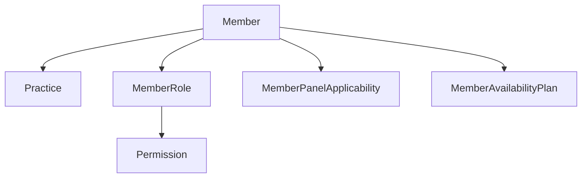

# SlotIQ Member Aggregate Technical Documentation

## Entity Definitions
The canonical source for all entity definitions is `MemberAggregateEntities.openapi.yaml`. This file defines:
- Base audit fields pattern
- Member aggregate root
- Child entities (panels, availability)
- Supporting entities
- All enum definitions

## API Contracts
The API contract `MemberAggregateContracts.openapi.yml` provides:
- RESTful endpoint definitions
- Request/response schemas
- Validation rules
- Error handling

## Entity Relationships

## Validation Rules
- Username: 5-100 chars, alphanumeric with dots/dashes
- Password: Min 8 chars, must include upper, lower, number, special
- Email: Must be @aspiresys.com domain
- Phone: 10 digits, optional
